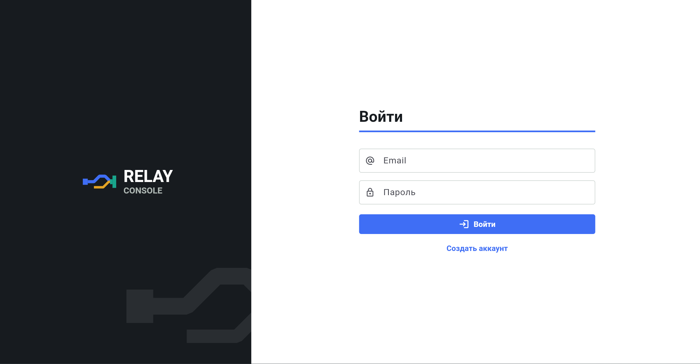
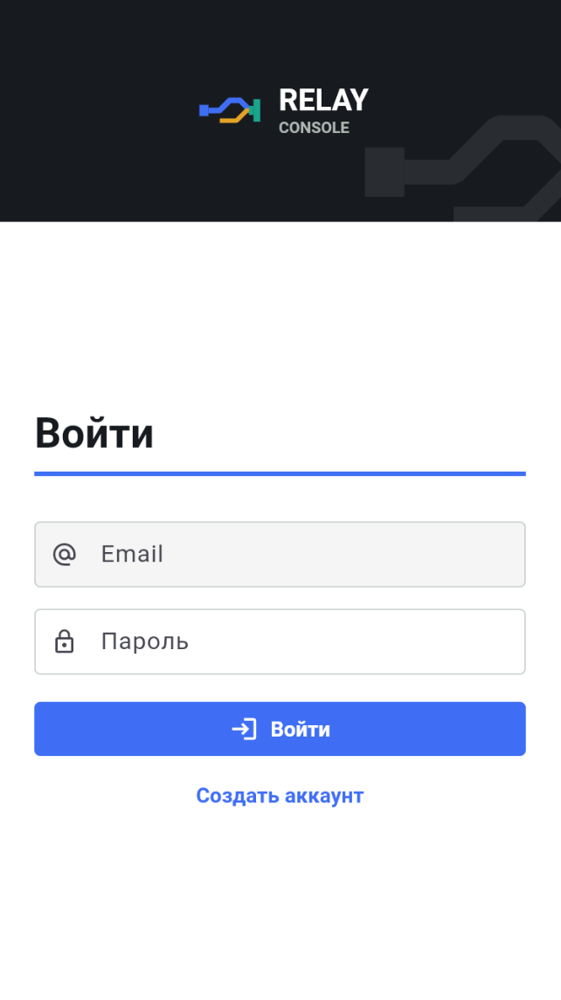
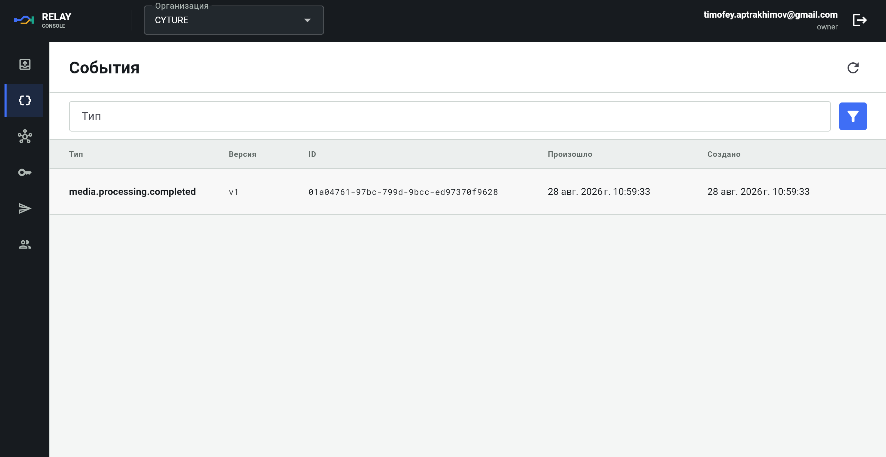
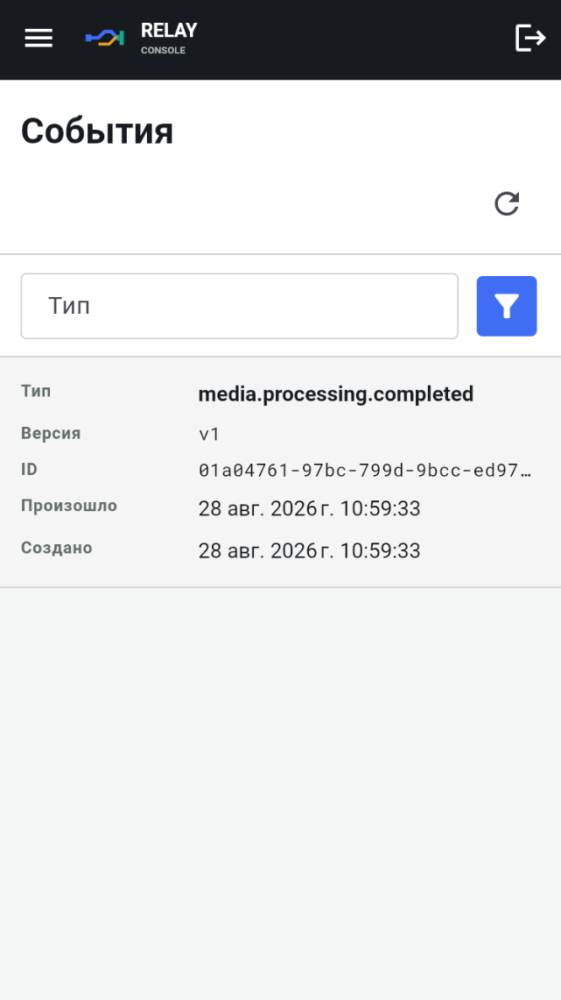

# Webhook Delivery Platform Client

Private Flutter operator console for the Webhook Delivery Platform backend.
The current interface applies the Relay Console brand through the Trace Desk
operational layout.

## Backend

This client is built for the
[Webhook Delivery Platform backend](https://github.com/TheReptilianSet/webhook_delivery_platform.git).
Run a compatible version of that backend before starting the client; its API is
the source of truth for the client contract.

## Implemented

- registration, sign-in, refresh-token rotation, sign-out, and `/me`;
- durable session storage through `flutter_secure_storage`;
- organization selection and role-aware actions;
- deliveries, delivery attempts, filters, details, and idempotent replay;
- events, event details, and producer-key event testing;
- endpoint create/update/verify/delete with one-time signing-secret handling;
- API-key create/list/revoke with one-time key handling;
- organization member list/add/role change/remove;
- English and Russian localization;
- responsive web, desktop, and mobile navigation.

## Interface previews

The screenshots show the responsive Relay Console interface against the
working authentication and event inspection flows.

### Authentication

#### Web



#### Mobile

<p align="center">
  
</p>

### Events

#### Web



#### Mobile

<p align="center">
  
</p>

## Toolchain

- Flutter `3.44.1` / Dart `3.12.1`;
- Retrofit + Dio for HTTP;
- Freezed and json_serializable for DTOs and Cubit state;
- go_router_builder for typed navigation;
- flutter_bloc for presentation state;
- fpdart `TaskEither` for typed repository failures.

Generated `*.g.dart` and `*.freezed.dart` files are committed artifacts. Do not
edit DTOs, JSON mapping, Retrofit clients, immutable state, or typed route
implementations by hand.

## Quickstart

Start the backend on `http://localhost:8000` before running the client. The
project requires Flutter `3.44.1`; use the same SDK for dependency resolution
and compilation.

### Build Web

Build the release application with one command:

```powershell
flutter build web --release --dart-define=API_BASE_URL=http://localhost:8000
```

The artifact is written to `build/web`. For local development in Chrome, run:

```powershell
flutter run -d chrome --dart-define=API_BASE_URL=http://localhost:8000
```

### Run with Docker

Compose resolves dependencies, builds the release application, starts Nginx,
and waits for its healthcheck:

```powershell
docker compose up --build -d --wait
```

Open `http://localhost:8080`. The health endpoint is available at
`http://localhost:8080/healthz`.

Stop and remove the local container with:

```powershell
docker compose down
```

To pause the container without removing it, use `docker compose stop`; resume it
with `docker compose start`.

`API_BASE_URL` is compiled into the Web application and must be reachable from
the end user's browser. The backend must allow requests from the client origin.
The local defaults are `http://localhost:8000` for the API and `8080` for the
Web port. Override them only when needed:

```powershell
$env:API_BASE_URL = "https://api.example.internal"
$env:WEB_PORT = "8081"
docker compose up --build -d --wait
```

The runtime container uses Nginx as an unprivileged user, has a Docker
healthcheck, and supports read-only execution through `compose.yaml`.

For an Android emulator, use
`--dart-define=API_BASE_URL=http://10.0.2.2:8000`.

## GitHub Actions

[`.github/workflows/ci.yml`](.github/workflows/ci.yml) runs code generation,
checks that generated files are committed, verifies formatting, analyzes,
tests, builds the web artifact, and builds the Docker image.

Before merging or tagging a release, create an Actions repository variable
named `API_BASE_URL` with the production backend URL. Pushes to `main` and tags
matching `v*` publish to `ghcr.io/<owner>/<repository>`. Pull requests build
the same Dockerfile without publishing it.

## Verify

```powershell
dart format --output=none --set-exit-if-changed lib test tool
flutter analyze
flutter test
```

## Architecture

The project applies Clean Architecture, Clean Code, pragmatic DDD, SOLID,
dependency inversion, feature-first ownership, KISS/YAGNI, deliberate DRY, and
explicit prevention of Spaghetti Code. See
[architecture_guidelines.md](architecture_guidelines.md) and the ADRs under
[docs/architecture/decisions](docs/architecture/decisions).

## Brand

The approved client name is `Relay Console`; the canonical mark is
`Relay Trace`. Brand rationale, color roles, safe-area rules, and the platform
output matrix are defined in [docs/brand_design.md](docs/brand_design.md).
Canonical SVG sources live under [assets/brand](assets/brand) and must not be
redrawn independently for Android, iOS, or Web.

The Flutter implementation uses shared tokens, Canvas mark geometry, a compact
context bar and navigation rail, responsive operational data grids, and a
delivery trace detail view. Feature screens must not define competing palettes
or generic card dashboards.

Regenerate all platform and generic PNG outputs with:

```powershell
flutter test --no-pub tool/generate_brand_assets_test.dart
```

## Next Product Phase

The following decisions are intentionally not guessed during functional
implementation and must be agreed before release:

1. Android application ID, Apple bundle ID, signing identities, and store data.
2. Backend/client production topology and target hosting environment.
3. Code signing and mobile artifact distribution.
4. Proprietary/private license terms and third-party notice policy.
5. Repository handoff order, access controls, secrets, and support ownership.
6. Production hardening: integration tests, observability, backup/recovery,
   security review, release channels, and an operations runbook.
